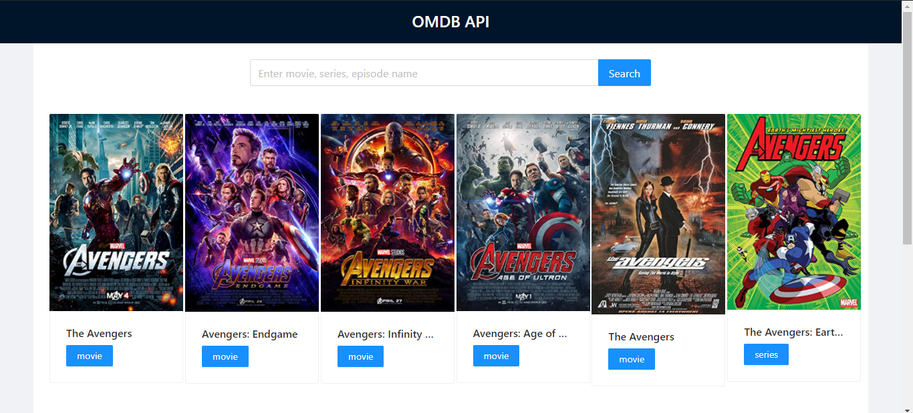
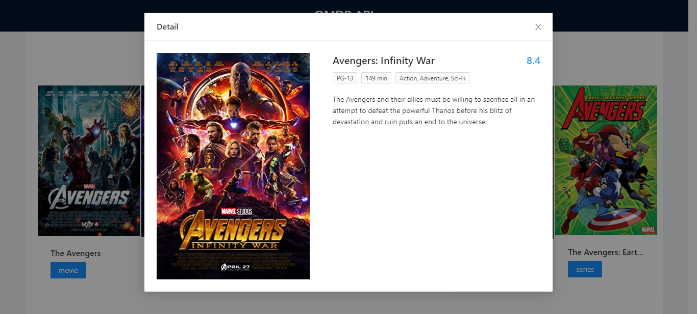
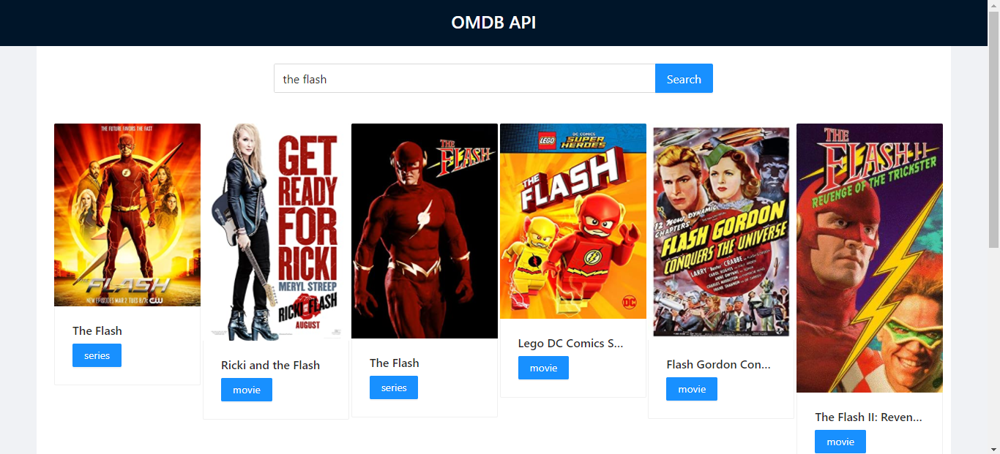

### OMDB API

## Preview

### Details

### On search

## Set up and Installation

### Clone this repository
* `https://github.com/cecibarasa/OMDB-API.git`

### Install dependecies 
* `run npm i`

### Get an API Key
* Click on http://www.omdbapi.com/.

## To run the project
* `npm start`
